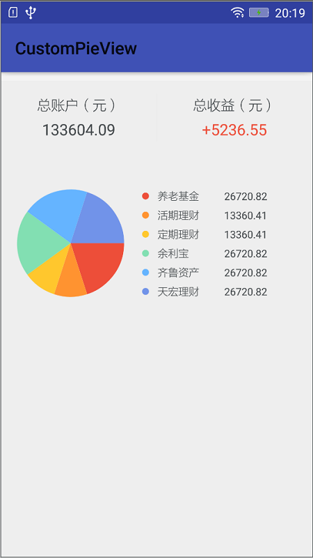

# CustomPieView
自定义饼状图，仿支付宝里面的资产分布情况。

# Gradle
    
    compile ('com.xyzlf.view:pieview:0.0.1') {
    	exclude group: 'com.android.support', module: 'appcompat-v7'
    }

# 效果图

# 关于我
有任何使用问题，可以给我发邮件：

Author：张利峰

E-mail：519578280@qq.com

# License

    Copyright(c)2016 xyzlf Open Source Project
    
    Licensed under the Apache License, Version 2.0 (the "License");
    you may not use this file except in compliance with the License.
    You may obtain a copy of the License at
    
    http://www.apache.org/licenses/LICENSE-2.0
    
    Unless required by applicable law or agreed to in writing, software
    distributed under the License is distributed on an "AS IS" BASIS,
    WITHOUT WARRANTIES OR CONDITIONS OF ANY KIND, either express or implied.
    See the License for the specific language governing permissions and
    limitations under the License.